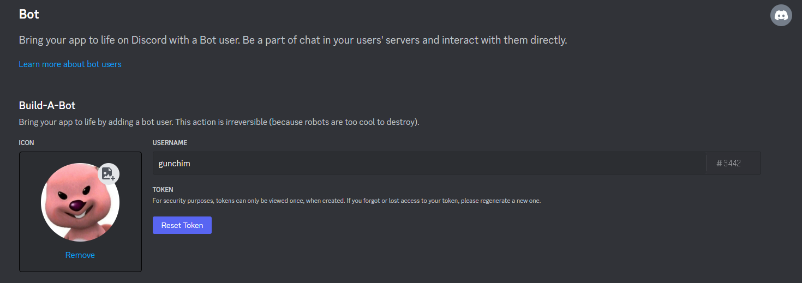
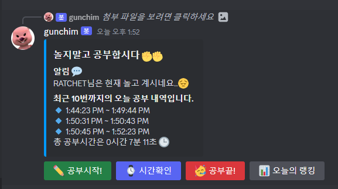
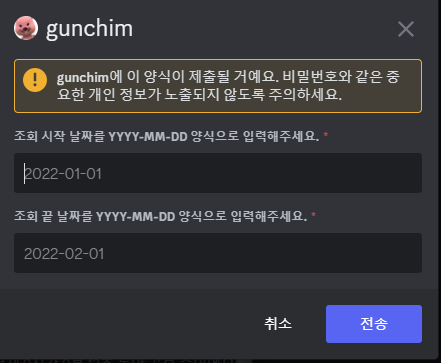
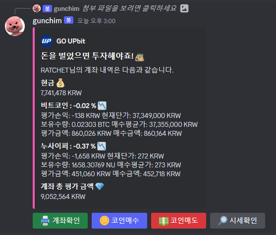
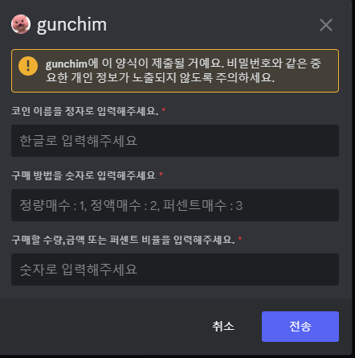

## 프로젝트 설명

공부 시간 측정 기능을 지원하여 디스코드 스터디 서버에서 사용할 수 있는 봇입니다. 공부 시간에 비례하여 가상 화폐를 받고 이를 모아 코인 투자를 할 수 있는 기능을 개발하였습니다.

2022/03 ~ 2022/07

## 구현한 기능

### **사용자의 공부한 시간 측정**

- “공부시작!” 버튼을 누르면 측정이 시작되고 “공부끝!” 버튼을 누르면 측정이 종료
- 스터디 서버 내의 다른 사용자와 비교하여 공부 시간 랭킹을 확인 가능(오늘의 랭킹, 이주의 랭킹, 이달의 랭킹 확인 가능)
- 하루가 지나면 오늘의 공부 내역을 데이터베이스에 저장하고 새로운 공부 내역 측정 시작
- “공부끝!”버튼을 누르지 않고 디스코드를 종료할 경우 자동으로 시간 측정을 중단
- 공부 시간 1초 당 100원의 가상 화폐 지급

### **가상 화폐로 모의 코인 투자 기능 개발**

- UPbit에 상장되어 있는 코인의 매수, 매도 지원
- 투자한 코인의 현재 수익률과 전체 예상 평가 금액 확인 가능

## 사용한 기술 스택

- **Node.js** : 어플리케이션의 규모가 크지 않고 웹응용프로그래밍 수업에서 자바스크립트를 사용한 경험이 있어 Node.js로 개발하게 되었습니다.
- **Discord.js** : 디스코드 봇 개발을 위해 사용하였습니다.
- **Azure App Service** : 개발한 디스코드 봇의 배포를 위해 사용하였습니다.
- **SQLite** : 어플리케이션의 규모가 크지 않아 간단하게 파일 형식으로 저장하기 위해 SQLite를 사용하였습니다.

## 결과물

### 봇 메인 페이지

### 공부 시간 측정 기능

- 현재 자신이 공부를 얼마나 했는지 알 수 있습니다.

- 일간, 주간, 월간별로 랭킹을 확인할 수 있습니다.
    
    
    

- 원하는 기간을 조회하여 랭킹을 확인할 수도 있습니다.
    
    
    

### 모의 투자 기능

- 코인을 구매한 후 현재 수익을 확인할 수 있습니다.

- UPbit에 존재하는 원하는 코인을 매수, 매도할 수 있습니다.

